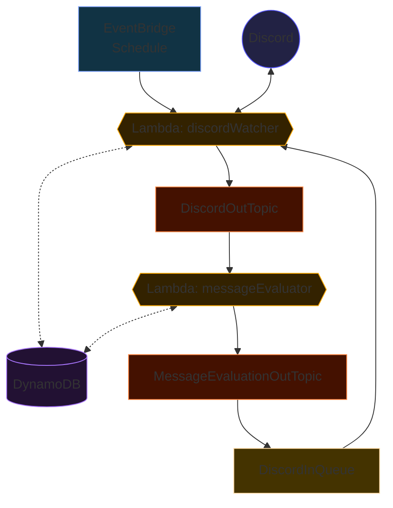

# Leetbot AWS

Leetbot in the cloud. See the [project dashboard](https://github.com/users/Misacorp/projects/1/views/1).

Leetbot is a Discord bot that monitors messages in Discord servers during specific time windows (13:36-13:39) to detect and track "leet" messages. It provides statistics and leaderboards for users based on their messaging patterns.

## Features

- 🕐 Time-based message monitoring (13:36-13:39 daily)
- 📊 Message type tracking (leet, leeb, failed_leet)
- 🏆 User statistics and leaderboards
- ☁️ Fully serverless AWS architecture
- 🌍 Timezone-aware scheduling with daylight savings support

## Prerequisites

Before setting up the project, ensure you have:

- [Node.js](https://nodejs.org/) (version 18 or higher)
- [AWS CLI](https://aws.amazon.com/cli/) configured with appropriate permissions
- [aws-vault](https://github.com/99designs/aws-vault) (recommended for credential management)
- A Discord bot token (see [Discord Developer Portal](https://discord.com/developers/applications))

---

<!-- TOC -->

- [Leetbot AWS](#leetbot-aws)
  - [Features](#features)
  - [Prerequisites](#prerequisites)
- [Development](#development)
  - [Scripts](#scripts)
- [Architecture](#architecture)
  - [Lambda Layers](#lambda-layers)
  - [DynamoDB Design](#dynamodb-design)
- [Deployment](#deployment)
  - [Deployment Troubleshooting](#deployment-troubleshooting)

<!-- TOC -->

# Development

Start by installing dependencies for both the main application and the Discord Lambda layer

```shell
npm install && npm install --prefix src/layers/discord/nodejs
```

The CDK stack itself is located in the `lib` directory.

## Scripts

Some scripts are included to help set up and test the application. They are located in the `scripts` folder.

> ⚠️ These scripts natively use `aws-vault`.

### Set Discord Bot Token

This script sets the AWS Systems Manager Parameter Store `SecureString` value for the Discord bot token. Usage:

```shell
./scripts/setBotToken.sh <bot_token> <aws_profile> <environment>
```

The deployed stack creates the parameter shell, but the real bot token value is
still written separately with this script after deployment.

### Start Discord Bot

This script starts the Discord bot by invoking the Discord Watcher Lambda function. You can supply test event parameters
to, for example, reduce the run time of the Lambda, or allow customized behavior. See the `TestEvent` interface in
`types.ts` for all the options.

```shell
./scripts/invokeDiscordWatcher.sh <json_payload> <aws_profile>

# Example:
# ./scripts/invokeDiscordWatcher.sh '{"timeoutOverrideMs": 12000}' sandbox
```

### Clean DynamoDB Table

Removes all items from the deployed DynamoDB table. Can optionally be given a specific target table name.

```shell
./scripts/cleanDynamoDbTable.sh <aws_profile> [<table_name>]
```

# Architecture

Leetbot needs to sit in a Discord server every day within the time window `]13:36, 13:39[`. This is achieved with a
Lambda that keeps itself alive for the duration. An EventBridge scheduled event invokes that Lambda at the same time on
each day and even takes daylight savings into account.

Low-latency Discord event paths use direct `SNS -> Lambda` delivery to avoid frequent SQS polling. The remaining
metrics path is intentionally `SNS -> SQS -> Lambda` and uses long polling because it is not latency-sensitive.


```mermaid
flowchart TD
    Discord((Discord))
    EventBridge[EventBridge<br/>Schedule]

    DiscordWatcher{{Lambda: discordWatcher}}
    DiscordOutTopic[DiscordOutTopic]
    MessageEvaluator{{Lambda: messageEvaluator}}
    MessageEvalOutTopic[MessageEvaluationOutTopic]
    DiscordInQueue[DiscordInQueue]
    DynamoDB[(DynamoDB)]

    EventBridge --> DiscordWatcher
    Discord <--> DiscordWatcher
    DiscordWatcher <-.-> DynamoDB
    DiscordWatcher --> DiscordOutTopic
    DiscordOutTopic --> MessageEvaluator
    MessageEvaluator <-.-> DynamoDB
    MessageEvaluator --> MessageEvalOutTopic
    MessageEvalOutTopic --> DiscordInQueue
    DiscordInQueue --> DiscordWatcher

    classDef discord stroke: #55f, fill: #224
    classDef lambda stroke: #fa0, fill: #320
    classDef sns stroke: #f84, fill: #410
    classDef sqs stroke: #fda, fill: #430
    classDef dynamo stroke: #a7f, fill: #213
    classDef schedule stroke: #8af, fill: #134

    class Discord discord
    class DiscordWatcher,MessageEvaluator lambda
    class DiscordOutTopic,MessageEvalOutTopic sns
    class DiscordInQueue sqs
    class DynamoDB dynamo
    class EventBridge schedule
```

CloudWatch alarms are configured for the low-latency `SNS -> Lambda` paths:

- SNS subscription DLQs alarm if SNS cannot deliver to the Lambda subscription
- Lambda async failure queues alarm if the Lambda accepts an event but still fails after retries
- the metrics queue DLQ also has an alarm

## Lambda Layers

The Discord SDK, date-fns,
and possibly other libraries are installed on Lambda layers in `lib/constructs/LambdaLayers.ts`.
For each Lambda function that wants to use, for example,
the Discord API, the Layer should be given in the function definition.

```ts
new NodejsFunction(this, "MyNodejsFunction", {
  layers: [props.layer],
  // ...other NodejsFunction configuration...
});
```

The Discord SDK (or other layers) can then be used in each Lambda handler from `/opt/nodejs/discord`. This is because
Lambda functions mount their layers in the `/opt` directory.

```ts
import discord from "/opt/nodejs/discord";
```

When adding more layers, update `tsconfig.json` with a matching path to that layer.

## DynamoDB Design

See the `types.ts` files in `src/repository` for detailed descriptions about database indices and access patterns.

# Deployment

> If you are using [aws-vault](https://github.com/99designs/aws-vault), prefix pretty much every command here with
> `aws-vault exec <your-role-name> -- <command>`

Run `npm run aws:deploy` to deploy the application.

Each `CfnOutput` will be saved to a `cdk-outputs.json` file, should you need to reference them.

## Deployment Troubleshooting

### No bucket named `xyz`. Is account `123` bootstrapped?

Fix this by doing one of the following:

#### Option 1: CLI

Run this script: `npm run aws:unbootstrap`

#### Option 2: AWS Management Console

1. Log in to the AWS Management Console and navigate to Cloudformation.
2. Delete the `CDKToolkit` stack.
3. Run `npx cdk bootstrap`.

Finally, re-bootstrap the environment with `npm run aws:bootstrap`. Deployment should work now.
